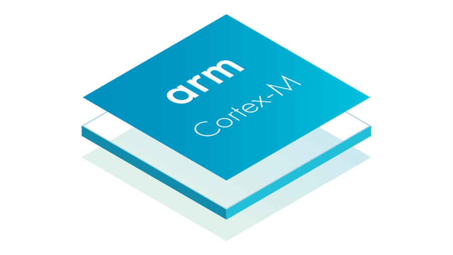

```json
{
    "front-matter": {
        "title": "ARM架构学习准备",
        "date": "2024-01-21",
        "author": "3oR",
        "tags": ["ARM"],
        "categories": ["ARM"],
        "description": "文章描述",
        "cover": "封面图片链接",
        "featured": false, 
        "draft": true 
	}
}
```

# ARM架构学习准备(STM32F103)



ここからノートを始めます。

1

2

3

4

